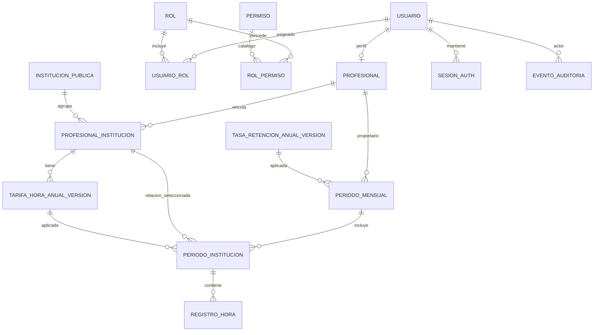

# PRD — Gestión de ingresos por honorarios para profesionales de la salud

**Versión:** 0.2
**Alcance:** Sistema público
**Estado:** Definición inicial de producto

Este documento define el contexto funcional del producto para el equipo y para agentes de IA. La arquitectura tecnológica se describe por separado en [el estándar frontend](FRONTEND_ARCHITECTURE_STANDARD.md) y [el estándar backend](BACKEND_ARCHITECTURE_STANDARD.md). Los requisitos explícitos de este PRD definen el comportamiento del producto; las decisiones marcadas **Por definir** no deben inferirse.

## 1. Resumen del producto

La aplicación permitirá a profesionales de la salud independientes que trabajan para instituciones del sistema público llevar un control mensual de sus horas trabajadas e ingresos por boletas de honorarios.

Un profesional puede prestar servicios simultáneamente a una o varias instituciones. Cada relación profesional-institución posee un valor bruto por hora asociado a un año. Las horas trabajadas son variables y dependen del profesional.

El registro es libre dentro de un mes. No exige días, turnos, semanas, jornadas ni motivos. Por ejemplo, para septiembre:

```text
Tucapel:        1 h × 20 registros = 20 h
Lorenzo Arenas: 10 h × 2 registros = 20 h
```

Ambas formas son válidas. El sistema utiliza los registros para calcular automáticamente horas totales, ingresos brutos, retención e ingresos líquidos estimados. El objetivo no es implementar un CRUD de horas, sino ofrecer una experiencia mensual de edición rápida, flexible y sencilla.

## 2. Problema

Los profesionales pueden trabajar el mismo mes para varias instituciones públicas y actualmente controlar sus horas mediante planillas. Esto genera dificultades porque:

- Las horas cambian continuamente durante el mes.
- Los ingresos deben recalcularse manualmente.
- La tasa de retención puede cambiar por año.
- Puede haber varias instituciones activas simultáneamente.
- Las planillas no facilitan el análisis histórico ni la consolidación de ingresos.
- Un CRUD tradicional hace lento el registro y la corrección de horas.

## 3. Objetivo del producto

Permitir que un profesional responda rápidamente:

> ¿Cuánto he trabajado este mes y cuánto dinero he generado?

Flujo principal:

```text
Abrir mes → ingresar/modificar horas → ver resultados inmediatamente
```

No debe requerirse ejecutar una operación manual de cálculo.

## 4. Usuarios y autorización

### Usuario objetivo

Profesional de la salud que:

- Trabaja de manera independiente.
- Presta servicios mediante boleta de honorarios.
- Trabaja para una o varias instituciones públicas.
- Recibe un valor bruto por hora.
- Necesita controlar horas e ingresos brutos y líquidos estimados.

### Roles conocidos

El sistema contempla los roles base `ADMINISTRADOR` y `PROFESIONAL`. Una cuenta puede tener varios roles, de acuerdo con el estándar de arquitectura.

El `ADMINISTRADOR` tiene acceso total al sistema y a los datos de todos los profesionales. El `PROFESIONAL` solo puede consultar y modificar su propia información: perfil profesional, relaciones con instituciones, tarifas horarias, períodos y registros de horas. La autorización se aplica en backend, incluso si se solicita un recurso directamente por su identificador.

Las instituciones públicas y la tasa anual de retención son configuraciones compartidas: `PROFESIONAL` puede consultarlas en modo lectura, pero no modificarlas. Las tarifas horarias son personales por relación profesional-institución y no son visibles entre profesionales.

| Rol               | Alcance                                                                                                                                                                                                      |
| ----------------- | ------------------------------------------------------------------------------------------------------------------------------------------------------------------------------------------------------------ |
| `PROFESIONAL`   | Gestiona su perfil, relaciones y tarifas propias, períodos y horas propias. Puede leer el catálogo público y la tasa anual común. No consulta datos personales ni financieros de otros profesionales.    |
| `ADMINISTRADOR` | Acceso total a datos y configuración del sistema, incluyendo profesionales, tarifas, períodos, horas y tasas anuales. Sus consultas/modificaciones de información personal y financiera quedan auditadas. |

## 5. Alcance inicial

La primera versión contempla exclusivamente prestaciones realizadas para **instituciones del sistema público**.

El sistema privado queda explícitamente fuera del MVP. Sus reglas pueden variar por institución, por ejemplo: valor por prestación, bonificaciones, porcentajes por atención, comisiones, turnos, metas o prestaciones específicas. Estas reglas deben modelarse posteriormente como otro dominio funcional, sin contaminar el cálculo público inicial.

## 6. Conceptos del dominio

### 6.1 Profesional

Persona autenticada que registra sus horas y consulta sus ingresos. Un profesional puede estar relacionado con varias instituciones y solo debe consultar/modificar información para la que tenga autorización.

### 6.2 Institución pública

Organización para la cual el profesional presta servicios; ejemplos: Tucapel, Lorenzo Arenas, Hospital Regional o CESFAM X.

Información conceptual mínima:

- Nombre.
- Estado.

El catálogo público es compartido y de lectura para profesionales; el `ADMINISTRADOR` puede administrarlo.

### 6.3 Relación profesional-institución

La configuración de trabajo asocia un profesional con una institución. El valor hora anual pertenece a esta relación, no a la institución global, porque dos profesionales pueden tener condiciones distintas en la misma institución.

### 6.4 Valor hora anual

Cada relación profesional-institución puede tener un valor hora por año. Por ejemplo:

| Institución   | Año | Valor hora bruto de ejemplo |
| -------------- | ---: | --------------------------: |
| Tucapel        | 2026 |                     $31.488 |
| Lorenzo Arenas | 2026 |                     $28.757 |

El valor no se duplica en cada registro de horas. Es un dato privado de la relación profesional-institución: un profesional no puede consultar la tarifa de otro. Los valores de años/versiones anteriores deben conservarse para consultar períodos históricos.

### 6.5 Período mensual

Es el espacio de trabajo principal y se identifica por profesional, año y mes. Por ejemplo: septiembre de 2026. Un período contiene las instituciones en las que el profesional trabajó ese mes.

### 6.6 Instituciones del período

Cada período permite seleccionar las instituciones participantes. La selección mensual no modifica la relación general del profesional con la institución.

### 6.7 Registro libre de horas

Un registro representa únicamente:

- La institución incluida en el período.
- La cantidad de horas.
- El orden visual dentro del grupo, si la UI lo necesita.

No es obligatorio registrar día, fecha, semana, turno, jornada ni motivo. Cada registro debe contener una cantidad entera de horas de **al menos 1**. No se admiten fracciones ni cero. Registros repetidos con el mismo valor son válidos y no se deduplican.

## 7. Reglas de cálculo

Para cada institución dentro de un período:

```text
Horas totales = SUM(registros enteros de horas)
Ingreso bruto CLP = Horas totales × Valor hora anual CLP
Retención sin redondear = Ingreso bruto CLP × Tasa anual común / 100
Retención institucional CLP = redondear Retención sin redondear al peso más cercano
Líquido institucional CLP = Ingreso bruto CLP − Retención institucional CLP
```

El resumen mensual consolida las horas, el bruto, la retención y el líquido estimado de todas las instituciones del período sumando los importes institucionales ya redondeados.

La retención se redondea **por institución** al peso más cercano, con regla *midpoint away from zero* (mitades alejándose de cero; `MidpointRounding.AwayFromZero` en .NET). El líquido institucional se calcula restando esa retención redondeada al bruto.

Todos los montos se expresan en pesos chilenos (**CLP**, sin decimales) y se almacenan como valores enteros exactos; no usar punto flotante. La tasa porcentual conserva precisión decimal (por ejemplo, 15,25 %). Los valores líquidos siguen siendo estimados.

## 8. Configuración anual e historia

### 8.1 Valor hora

El valor hora se consulta por relación profesional-institución y año/version. Así, septiembre de 2026 continúa usando la versión de tarifa que tenía aplicada aunque se publique otra versión para períodos posteriores.

### 8.2 Retención de honorarios

La tasa de retención es **global y común a todos los profesionales**, se administra por año/version y se selecciona según el período. No se hardcodea en frontend ni en lógica de negocio. El profesional puede consultar la tasa aplicable en modo lectura; solo el `ADMINISTRADOR` puede modificar la configuración. El PRD incluye como ejemplo 15,25 % para 2026 y 16,00 % para 2027; esos valores deben validarse antes de configurarlos como oficiales.

### 8.3 Conservación histórica

Las consultas históricas conservan las reglas aplicadas a su período. Cada `PERIODO_INSTITUCION` referencia la versión exacta del valor hora utilizada y cada `PERIODO_MENSUAL` referencia la versión exacta de la tasa de retención utilizada. Las versiones referenciadas no se editan en sitio: una corrección crea una versión nueva para períodos futuros. Los períodos existentes no se recalculan silenciosamente; cualquier recálculo histórico requiere una operación explícita y auditada.

## 9. Workspace mensual

La pantalla principal se comporta como un espacio de trabajo, no como una lista de registros con navegación CRUD. Agrupa las instituciones del mes y muestra registros y resultados en el mismo contexto.

Ejemplo de estructura:

```text
                         SEPTIEMBRE 2026

       TUCAPEL                              LORENZO ARENAS
       $31.488/h                            $28.757/h

       [ 6 ]                                [ 9 ]
       [ 6 ]                                [ 9 ]
       [ 6 ]                                [ 9 ]
       + agregar horas                      + agregar horas

       42 horas                             27 horas
       $1.322.496 bruto                     $776.439 bruto
       $1.120.815 líquido est.              $658.032 líquido est.

                         RESUMEN DEL MES
       Horas: 69 · Bruto: $2.098.935 · Retención: $320.088 ·
       Líquido estimado: $1.778.847
```

Cada institución mostrará como mínimo nombre, valor hora, cantidad de registros, horas totales, bruto, retención estimada y líquido estimado. El total consolidado del mes permanece visible.

## 10. Interacción y UX

### Agregar, editar y eliminar

- Agregar un registro desde el final del grupo con acción `+ agregar horas`.
- Dejar el nuevo valor disponible inmediatamente para escribir.
- Editar el valor inline sin abrir una pantalla o modal.
- Eliminar cada registro rápidamente, sin navegación a otra pantalla.
- Permitir cualquier cantidad de registros desde la regla de negocio; límites técnicos de tamaño/consumo no deben convertirse en un límite funcional arbitrario.

### Teclado

El editor debe permitir una experiencia similar a una planilla. Como mínimo, considerar `Enter`, `Tab`, flechas y `Backspace/Delete`. Ejemplo: escribir `6`, presionar `Enter` y recibir inmediatamente una fila nueva para continuar.

### Autoguardado

No depender de un botón Guardar para cada cambio. Mostrar estados claros:

```text
Guardando… → Guardado
             Error al guardar
```

La estrategia para cambios simultáneos, reintentos, desconexión y conflictos entre pestañas/dispositivos está **Por definir**. El producto debe evitar que un error de red dé la impresión de que un cambio no guardado sí quedó persistido.

### Recálculo

Agregar, editar o eliminar horas actualiza inmediatamente las horas e importes visibles. La UI puede mostrar un cálculo optimista mientras guarda; el resultado confirmado por backend es autoritativo.

## 11. Navegación y selección de instituciones

- Navegación entre meses anterior y siguiente.
- Selector por mes y año.
- Cada mes permite seleccionar las instituciones en que se trabajó.
- Agregar una institución a un mes no cambia la configuración general del profesional.
- No se presupone que todas las instituciones estén activas en todos los períodos.

## 12. Historias de usuario

| ID    | Historia                                                                                                                             |
| ----- | ------------------------------------------------------------------------------------------------------------------------------------ |
| HU-01 | Como profesional, quiero registrar una institución pública para asociarle posteriormente mis horas.                                |
| HU-02 | Como profesional, quiero definir el valor hora de una institución para un año determinado para calcular ingresos automáticamente. |
| HU-03 | Como profesional, quiero acceder a un mes específico para revisar horas e ingresos.                                                 |
| HU-04 | Como profesional, quiero indicar en qué instituciones trabajé durante el mes.                                                      |
| HU-05 | Como profesional, quiero agregar libremente cantidades de horas sin asociarlas obligatoriamente a fecha o jornada.                   |
| HU-06 | Como profesional, quiero editar inline cualquier cantidad ingresada.                                                                 |
| HU-07 | Como profesional, quiero eliminar un registro ingresado incorrectamente.                                                             |
| HU-08 | Como profesional, quiero ver automáticamente la suma de horas por institución.                                                     |
| HU-09 | Como profesional, quiero ver automáticamente el ingreso bruto por institución.                                                     |
| HU-10 | Como profesional, quiero ver un líquido estimado con la retención correspondiente al año.                                         |
| HU-11 | Como profesional, quiero ver el resumen consolidado del mes.                                                                         |
| HU-12 | Como profesional, quiero consultar períodos anteriores sin alterar sus cálculos históricos.                                       |
| HU-13 | Como profesional, quiero que mis períodos, tarifas y horas sean visibles solo para mí y para administradores autorizados.          |
| HU-14 | Como administrador, quiero administrar y consultar todos los datos y configuraciones del sistema.                                    |
| HU-15 | Como profesional, quiero consultar la tasa de retención anual común sin poder modificarla.                                         |

## 13. Requisitos funcionales

| ID    | Requisito                                                                                                              |
| ----- | ---------------------------------------------------------------------------------------------------------------------- |
| RF-01 | Crear y administrar instituciones públicas.                                                                           |
| RF-02 | Asociar instituciones al profesional.                                                                                  |
| RF-03 | Definir el valor hora por relación profesional-institución y año.                                                   |
| RF-04 | Administrar la tasa de retención por año.                                                                            |
| RF-05 | Acceder a períodos mensuales.                                                                                         |
| RF-06 | Asociar instituciones participantes a un período.                                                                     |
| RF-07 | Registrar libremente horas sin requerir fecha.                                                                         |
| RF-08 | Editar horas inline.                                                                                                   |
| RF-09 | Eliminar registros de horas.                                                                                           |
| RF-10 | Calcular horas totales automáticamente.                                                                               |
| RF-11 | Calcular ingreso bruto automáticamente.                                                                               |
| RF-12 | Calcular retención según el año automáticamente.                                                                   |
| RF-13 | Calcular líquido estimado.                                                                                            |
| RF-14 | Calcular el consolidado mensual.                                                                                       |
| RF-15 | Consultar períodos históricos.                                                                                       |
| RF-16 | Navegar rápidamente entre meses.                                                                                      |
| RF-17 | Aislar en backend los datos por profesional y permitir acceso global al rol`ADMINISTRADOR`.                          |
| RF-18 | Permitir consulta de solo lectura de la tasa anual común para`PROFESIONAL`; administración para `ADMINISTRADOR`. |
| RF-19 | Conservar la versión de tarifa y retención aplicada a cada período.                                                 |

## 14. Criterios de aceptación

### CA-01 — Registro libre

Dado un período con Tucapel, al registrar cuatro filas de una hora, el sistema muestra cuatro registros y cuatro horas totales.

### CA-02 — Distribución arbitraria

Si dos profesionales registran 20 horas para la misma relación tarifaria, uno como veinte filas de una hora y otro como dos filas de diez horas, ambos obtienen 20 horas y el mismo bruto.

### CA-03 — Recálculo al editar

Si existen 20 horas y una fila de una hora se cambia a dos, el total pasa inmediatamente a 21 y los importes se actualizan.

### CA-04 — Recálculo al eliminar

Si existen dos filas de diez horas y se elimina una, el total pasa a diez y bruto, retención y líquido se actualizan.

### CA-05 — Cambio de año

Un período de diciembre de 2026 utiliza la tarifa y tasa de 2026; enero de 2027 utiliza las configuraciones de 2027.

### CA-06 — Aislamiento por profesional

Dado que dos profesionales tienen períodos, tarifas y horas distintas, un usuario con rol `PROFESIONAL` solo obtiene y modifica sus propios datos. Una solicitud directa por el identificador de un recurso de otro profesional no devuelve su contenido ni permite modificarlo. Un `ADMINISTRADOR` puede acceder a los datos de todos.

### CA-07 — Horas enteras

El sistema acepta registros de horas enteras de 1 o más. Rechaza cero, valores negativos y fracciones; acepta registros repetidos con la misma cantidad.

### CA-08 — Cálculo y redondeo CLP por institución

Con tarifa de $31.488 CLP/h, 42 horas y tasa de 15,25 %, el bruto es $1.322.496, la retención se redondea desde $201.680,64 a $201.681 y el líquido estimado es $1.120.815. El consolidado mensual suma las retenciones y líquidos institucionales ya redondeados.

### CA-09 — Retención global de solo lectura

Una versión anual de retención tiene el mismo porcentaje para todos los profesionales durante su vigencia. El profesional puede consultarla, pero solo el administrador puede modificarla.

### CA-10 — Conservación de versiones

Si se publica una nueva versión de una tarifa o tasa, los períodos existentes conservan la versión que aplicaron y los períodos nuevos usan la versión vigente. Una corrección no altera silenciosamente cálculos históricos.

## 15. Pantallas del MVP

El MVP puede organizarse en cinco áreas principales:

1. Dashboard.
2. Mes de trabajo — pantalla fundamental.
3. Instituciones.
4. Tarifas/valores hora.
5. Configuración.

Dashboard inicial: horas trabajadas, bruto acumulado, retención estimada y líquido estimado, además de los resultados por institución.

## 16. Fuera del alcance del MVP

- Instituciones privadas y sus reglas particulares.
- Remuneraciones dependientes y contratos laborales.
- Previsión, Fonasa/Isapre, AFP o licencias médicas.
- Emisión automática de boletas, integración con SII, conciliación bancaria, facturación o pagos efectivamente recibidos.
- Agenda clínica, pacientes, prestaciones médicas, turnos obligatorios o control de asistencia.
- Registro obligatorio por día.

## 17. Métricas futuras

La estructura podrá habilitar posteriormente:

- Ingresos y horas mensuales/anuales.
- Ingreso por institución y porcentaje de ingresos por institución.
- Valor promedio por hora.
- Institución que genera más ingresos.
- Evolución y proyección de ingresos/horas.

Estas métricas no amplían por sí mismas el alcance del MVP.

## 18. Diagrama relacional conceptual

El siguiente ERD es la base relacional del MVP. Define relaciones y reglas de integridad conceptuales; los nombres finales y el DDL se concretan durante el diseño físico.



### Entidades y atributos conceptuales

| Entidad                          | Atributos principales                                                                  | Propósito                                                                                 |
| -------------------------------- | -------------------------------------------------------------------------------------- | ------------------------------------------------------------------------------------------ |
| `USUARIO`                      | `id`, `identity_subject`, `activo`                                               | Identidad autenticada; puede tener varios roles.                                           |
| `PROFESIONAL`                  | `id`, `usuario_id` único, datos del perfil                                        | Perfil propio de una cuenta con rol profesional.                                           |
| `ROL`, `USUARIO_ROL`         | código, asignaciones                                                                  | Roles`ADMINISTRADOR` y `PROFESIONAL`; una cuenta puede tener ambos.                    |
| `PERMISO`, `ROL_PERMISO`     | código, relación rol-permiso                                                         | Capacidades de UI/API; se aplican en backend.                                              |
| `INSTITUCION_PUBLICA`          | `id`, nombre, estado                                                                 | Catálogo global de lectura para profesionales y administración del Administrador.        |
| `PROFESIONAL_INSTITUCION`      | profesional, institución, estado                                                      | Relación de trabajo y ámbito de propiedad de la tarifa.                                  |
| `TARIFA_HORA_ANUAL_VERSION`    | relación profesional-institución, año, versión, valor CLP entero, vigente          | Tarifa privada por profesional, institución y año.                                       |
| `TASA_RETENCION_ANUAL_VERSION` | año, versión, porcentaje decimal, vigente                                            | Tasa global común a todos; lectura para Profesional y administración para Administrador. |
| `PERIODO_MENSUAL`              | profesional, año, mes, versión de retención aplicada                                | Espacio mensual y dueño de los datos.                                                     |
| `PERIODO_INSTITUCION`          | período, profesional, relación profesional-institución, versión de tarifa aplicada | Institución participante y tarifa histórica usada en ese período.                       |
| `REGISTRO_HORA`                | período-institución, horas enteras, orden, timestamps                                | Fila sin fecha; horas`>= 1`; valores repetidos válidos.                                 |
| `SESION_AUTH`                  | usuario,`sid`, hash refresh, familia, expiraciones, revocación                      | Sesiones revocables; nunca almacenar el refresh token en claro.                            |
| `EVENTO_AUDITORIA`             | actor, acción, profesional afectado, recurso, fecha, correlación                     | Auditoría de accesos administrativos y cambios sensibles; no guardar secretos ni tokens.  |

### Claves, restricciones y propiedad de datos

- `PROFESIONAL.usuario_id` es único: una cuenta tiene como máximo un perfil profesional.
- `PROFESIONAL_INSTITUCION` es único por `(profesional_id, institucion_id)`.
- `TARIFA_HORA_ANUAL_VERSION` se identifica por relación profesional-institución, año y versión; solo una versión es la vigente para nuevas asignaciones.
- `TASA_RETENCION_ANUAL_VERSION` se identifica por año y versión; solo una versión es la vigente para nuevos períodos de ese año.
- `PERIODO_MENSUAL` es único por `(profesional_id, anio, mes)` y referencia la versión de retención aplicada.
- La versión de retención referenciada por `PERIODO_MENSUAL` debe corresponder al mismo año del período.
- `PERIODO_INSTITUCION` es único por `(periodo_id, profesional_institucion_id)` y referencia la versión exacta de tarifa usada. Su período, relación profesional-institución y tarifa deben corresponder al mismo profesional y año.
- Para reforzar la propiedad en la base, se usarán claves foráneas compuestas con `profesional_id` (y año cuando aplique) en `PERIODO_INSTITUCION`. Esa columna puede repetirse para que PostgreSQL valide que período y relación pertenecen a la misma persona.
- `REGISTRO_HORA.horas` es un entero `CHECK (horas >= 1)`. No se crea unicidad por cantidad de horas. `orden` permite mantener el orden visual.
- Las tablas de configuración versionadas referenciadas por períodos no se editan en sitio. Una corrección crea una nueva versión; los períodos existentes conservan sus referencias.
- Los totales de horas, bruto, retención y líquido son derivados; no se almacenan como datos editables ni se duplican en cada registro.
- Las tarifas y todos los importes se guardan como enteros exactos en CLP (escala 0); la tasa de retención conserva precisión decimal porque es un porcentaje, no un monto.

### Ámbito de visibilidad

| Rol               | Acceso                                                                                                                                                                         |
| ----------------- | ------------------------------------------------------------------------------------------------------------------------------------------------------------------------------ |
| `PROFESIONAL`   | CRUD de sus relaciones, tarifas propias, períodos y registros; lectura del catálogo público y tasa anual común. Ningún dato personal o financiero de otros profesionales. |
| `ADMINISTRADOR` | Acceso total a profesionales, datos financieros y configuraciones; toda lectura/cambio administrativo queda sujeta a auditoría.                                               |

El backend obtiene el `profesional_id` desde el sujeto autenticado. Nunca acepta el dueño como autoridad desde body, query, ruta o estado del frontend. Cada consulta y mutación valida propiedad en backend; los IDs no evitan el aislamiento.

## 19. Reglas de negocio

- **RN-01:** Un profesional puede tener varias instituciones públicas.
- **RN-02:** Una relación profesional-institución puede tener un valor hora diferente por año.
- **RN-03:** Dentro del año, se utiliza el valor hora configurado para ese año.
- **RN-04:** Los registros de horas pertenecen a un período mensual.
- **RN-05:** Cada registro pertenece a una institución participante del período.
- **RN-06:** No es obligatorio asociar una fecha a un registro.
- **RN-07:** No existe límite funcional para la cantidad de registros de horas del profesional.
- **RN-08:** Registros con la misma cantidad son válidos y no se deduplican.
- **RN-09:** El total de horas es calculado: suma de los registros.
- **RN-10:** El bruto es calculado: horas totales × valor hora aplicable.
- **RN-11:** La retención depende del año del período.
- **RN-12:** El líquido se presenta como estimado.
- **RN-13:** Modificar un registro recalcula los resultados.
- **RN-14:** Eliminar un registro recalcula los resultados.
- **RN-15:** Los períodos históricos conservan las reglas que les correspondían; las correcciones no son silenciosas.
- **RN-16:** `PROFESIONAL` solo puede consultar/modificar información propia. `ADMINISTRADOR` tiene acceso total; el backend valida la propiedad en toda operación.
- **RN-17:** El valor hora es privado por relación profesional-institución y año/version; no se expone entre profesionales.
- **RN-18:** La tasa de retención es común y versionada por año; profesional puede leerla, solo administrador puede modificarla.
- **RN-19:** Cada registro de horas es un entero mayor o igual a 1. No se permiten fracciones ni cero.
- **RN-20:** La moneda es CLP sin decimales. Los montos se almacenan como valores enteros exactos.
- **RN-21:** Redondear la retención al peso más cercano por institución con `MidpointRounding.AwayFromZero`; líquido institucional es bruto menos retención redondeada y el resumen mensual suma resultados institucionales.
- **RN-22:** Cada período conserva la versión exacta de la tarifa horaria y de la tasa de retención aplicada al crearse o asociarse la institución.

## 20. Principio de diseño del producto

> El sistema no decide cómo el profesional debe descomponer sus horas. El profesional elige la forma de registrarlas; el sistema las suma, calcula y presenta.

La experiencia buscada es abrir el mes, escribir valores inline, usar `Enter` para continuar y ver los resultados actualizados, no completar un formulario y regresar a una lista después de cada registro.

## 21. Definición del MVP

El MVP 1.0 se considera funcional cuando un profesional autorizado puede:

1. Crear/seleccionar sus instituciones públicas.
2. Definir su valor hora anual por institución.
3. Abrir un período mensual y agregar sus instituciones participantes.
4. Crear libremente cualquier cantidad de registros de horas y editarlos/eliminarlos rápidamente.
5. Ver horas acumuladas, bruto, retención del año y líquido estimado por institución y como consolidado.
6. Consultar períodos históricos con las reglas correspondientes al período.

El núcleo del producto es:

```text
Institución + valor hora anual + período mensual + registros libres de horas
                                ↓
                  cálculos y consolidado mensual
```

## 22. Decisiones pendientes

Estas decisiones requieren definición antes de implementar las reglas correspondientes:

1. **Autoguardado:** debounce, feedback, reintentos, edición concurrente y resolución de conflictos entre pestañas/dispositivos.
2. **Orden y reversión:** si se permite reordenar manualmente las filas y si se requiere deshacer/restaurar eliminaciones.
3. **Límites técnicos:** elegir tipos de almacenamiento y límites de entrada suficientemente amplios sin imponer un límite funcional de registros.
4. **Datos de prueba tributarios:** validar tasas anuales antes de considerarlas oficiales.

Hasta resolverlas, la IA debe conservarlas como decisiones abiertas y no inventar comportamientos.

## 23. Directrices para agentes de IA

- Tratar este PRD como fuente funcional de verdad para el módulo público.
- No convertir el workspace mensual en un flujo CRUD de formularios/modal por registro.
- No exigir día, turno, semana, jornada ni motivo a los registros de horas.
- No deduplicar filas repetidas ni imponer un límite funcional de cantidad de registros.
- No hardcodear tasas tributarias o valores hora; conservar su año y su contexto profesional-institución.
- No añadir reglas del sector privado ni emitir boletas o pagos reales en el MVP.
- Respetar el acceso global de `ADMINISTRADOR` y el aislamiento propio de `PROFESIONAL`; no exponer tarifas de otro profesional.
- Respetar horas enteras `>= 1`, CLP sin decimales, redondeo por institución y versiones históricas aplicadas.
- No inventar comportamientos para decisiones que siguen pendientes: conflicto/autoguardado, reversión/reorden y límites técnicos de almacenamiento.
- Aplicar la autorización del backend definida en los estándares; guards y componentes React solo controlan la experiencia visual.
- Mantener los cálculos mostrados actualizados; el backend es la autoridad del resultado persistido.
- Si un requisito técnico parece contradecir una regla de producto, describir el conflicto y pedir decisión antes de cambiar el comportamiento.
